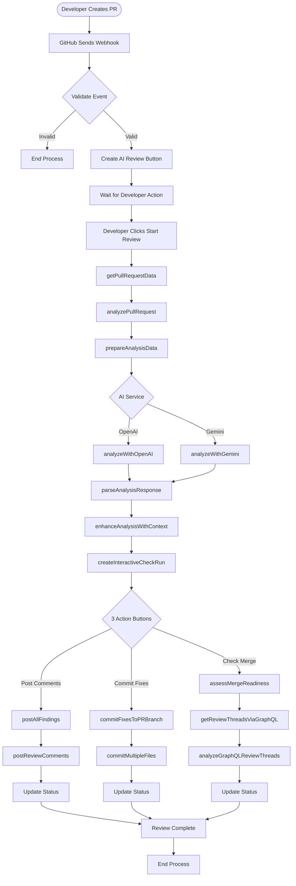
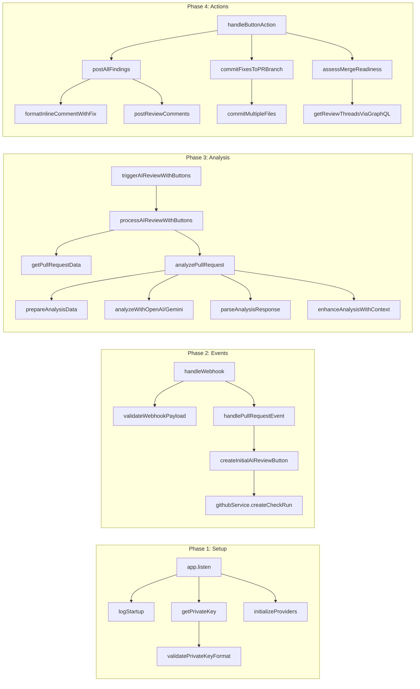
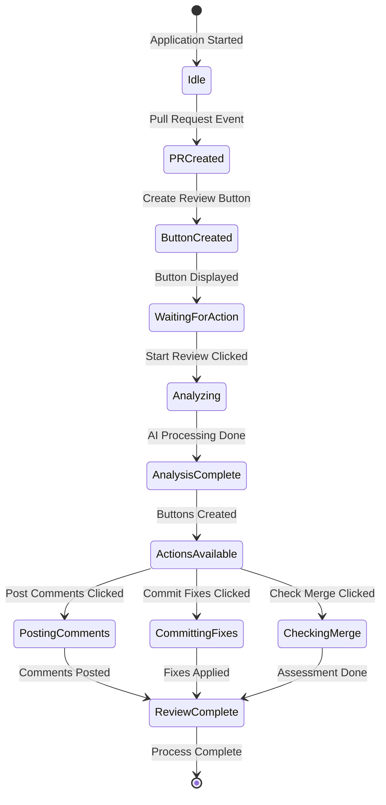
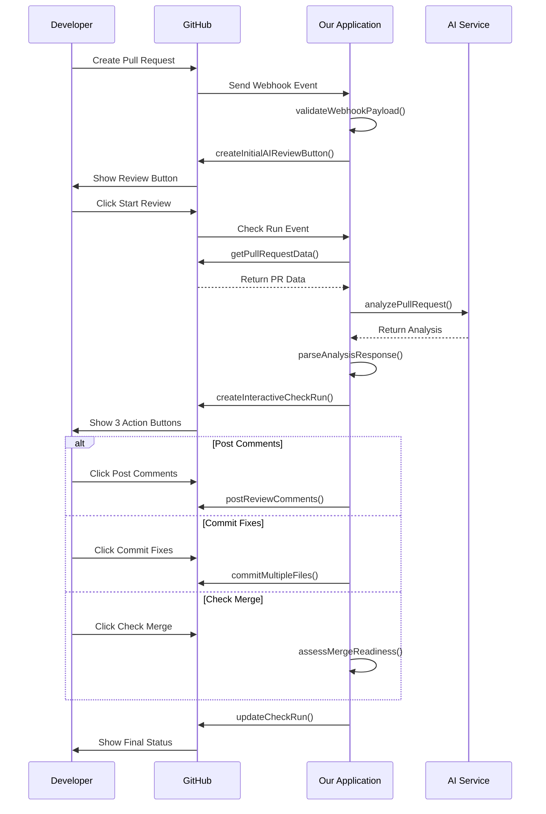

# 🤖 GitHub AI Code Reviewer - Complete Process Guide

## 📚 Table of Contents
1. [Overview for Non-Developers](#overview-for-non-developers)
2. [Complete Step-by-Step Process](#complete-step-by-step-process)
3. [Visual Flow Diagrams](#visual-flow-diagrams)
4. [Draw.io Diagram Code](#drawio-diagram-code)
5. [Mermaid Diagrams](#mermaid-diagrams)

---

## 🎯 Overview for Non-Developers

Think of this application as an **AI-powered assistant** that automatically reviews code changes before they're added to a software project. Here's what happens in simple terms:

1. **Developer submits code** → Like submitting a document for review
2. **AI analyzes the code** → Like a spell-checker but for programming mistakes
3. **Issues are found** → The AI identifies problems and suggests fixes
4. **Interactive buttons appear** → Options to apply fixes or post comments
5. **Automatic fixes applied** → The AI can fix problems automatically
6. **Code is ready to merge** → The changes can be safely added to the main project

---

## 📋 Complete Step-by-Step Process

### 🚀 **PHASE 1: INITIAL SETUP**

#### **Step 1: Application Startup**
**What happens:** The application starts and prepares to receive requests from GitHub

**Functions Used:**
- `app.listen()` - Starts the web server
- `logStartup()` - Displays startup messages
- `getPrivateKey()` - Loads security credentials
- `validatePrivateKeyFormat()` - Checks credentials are valid
- `initializeProviders()` - Connects to AI services (OpenAI/Gemini)

**Output:** ✅ Application is running and ready to receive GitHub events

**Next:** Wait for a developer to create or update a pull request

---

### 📨 **PHASE 2: RECEIVING GITHUB EVENTS**

#### **Step 2: Developer Creates/Updates Pull Request**
**What happens:** A developer submits code changes for review on GitHub

**Functions Used:**
- GitHub automatically sends a webhook to our application
- `app.post('/webhook')` - Receives the GitHub notification
- `validateWebhookHeaders()` - Verifies the request is from GitHub
- `handleWebhook()` - Main function that processes the event
- `validateWebhookPayload()` - Checks the data is complete

**Output:** ✅ Valid pull request event received

**Next:** Create review buttons for the developer

---

#### **Step 3: Create Initial Review Buttons**
**What happens:** The system creates clickable buttons in GitHub for starting the AI review

**Functions Used:**
- `handlePullRequestEvent()` - Processes the pull request event
- `createInitialAIReviewButton()` - Creates "Start AI Review" button
- `githubService.createCheckRun()` - Adds the button to GitHub

**Output:** ✅ "Start AI Review" button appears in GitHub

**Next:** Wait for developer to click the button

---

### 🔍 **PHASE 3: AI ANALYSIS**

#### **Step 4: Developer Clicks "Start AI Review"**
**What happens:** The developer initiates the AI review process

**Functions Used:**
- `handleCheckRunEvent()` - Detects button click
- `handleInitialReviewRequest()` - Processes the review request
- `findPRByCommitSha()` - Finds the correct pull request
- `triggerAIReviewWithButtons()` - Starts the AI analysis

**Output:** ✅ AI analysis process initiated

**Next:** Fetch all pull request data

---

#### **Step 5: Gather Pull Request Data**
**What happens:** The system collects all information about the code changes

**Functions Used:**
- `processAIReviewWithButtons()` - Manages the review process
- `githubService.getPullRequestData()` - Fetches:
  - Changed files
  - Code modifications
  - Existing comments
  - Author information
  - Review history

**Output:** ✅ Complete pull request data collected

**Next:** Send data to AI for analysis

---

#### **Step 6: AI Analyzes the Code**
**What happens:** The AI examines the code for issues, bugs, and improvements

**Functions Used:**
- `aiService.analyzePullRequest()` - Main AI analysis function
- `prepareAnalysisData()` - Formats data for AI
- `analyzeWithOpenAI()` OR `analyzeWithGemini()` - Sends to AI service
- `parseAnalysisResponse()` - Converts AI response to structured format
- `enhanceAnalysisWithContext()` - Adds additional context

**Output:** ✅ AI identifies:
- 🐛 Bugs
- 🔒 Security vulnerabilities  
- 📝 Code quality issues
- 💡 Improvement suggestions

**Next:** Create interactive action buttons

---

### 🎮 **PHASE 4: INTERACTIVE ACTIONS**

#### **Step 7: Create Interactive Buttons**
**What happens:** The system creates buttons for different actions based on AI findings

**Functions Used:**
- `completeWithButtonsCheckRun()` - Finalizes the review
- `githubService.postStructuredReviewComment()` - Posts summary comment
- `checkRunButtonService.createInteractiveCheckRun()` - Creates buttons:
  - 📝 "Post All Comments" button
  - 🔧 "Commit All Fixes" button
  - ✅ "Check Merge Ready" button
- `getPostableFindings()` - Filters which findings can be posted
- `generateCheckRunActions()` - Creates button configurations

**Output:** ✅ Three action buttons appear in GitHub

**Next:** Wait for developer to choose an action

---

### 💬 **PHASE 5A: POSTING COMMENTS (If developer clicks "Post All Comments")**

#### **Step 8A: Post AI Findings as Comments**
**What happens:** The AI's findings are posted as inline comments on specific lines of code

**Functions Used:**
- `checkRunButtonService.handleButtonAction()` - Processes button click
- `postAllFindings()` - Main function for posting comments
- `githubService.validateCommentableLine()` - Checks if line can receive comments
- `githubService.findCommentableLine()` - Finds nearest valid line if needed
- `formatInlineCommentWithFix()` - Formats comment with fix suggestion
- `aiService.generateCodeFixSuggestion()` - Creates specific fix code
- `githubService.postReviewComments()` - Posts all comments to GitHub

**Output:** ✅ Comments appear on specific lines with:
- Issue description
- Severity level
- Suggested fix code

**Next:** Update button states

---

### 🔧 **PHASE 5B: AUTOMATIC FIXES (If developer clicks "Commit All Fixes")**

#### **Step 8B: Apply Fixes Automatically**
**What happens:** The AI automatically fixes the identified issues in the code

**Functions Used:**
- `checkRunButtonService.handleButtonAction()` - Processes button click
- `checkRunButtonService.commitFixesToPRBranch()` - Initiates fix process
- `githubService.commitFixesToPRBranch()` - Main fix application function
- `githubService.getFileContentFromPR()` - Gets current file content
- `githubService.applyAdvancedFixToContent()` - Applies fixes to content
- `githubService.commitMultipleFiles()` - Creates single commit with all fixes:
  - `createBlob()` - Creates file content objects
  - `createTree()` - Creates file structure
  - `createCommit()` - Creates the commit
  - `updateRef()` - Updates the branch

**Output:** ✅ All fixes applied in a single commit with:
- Fixed code
- Detailed commit message
- List of all applied fixes

**Next:** Update button states

---

### ✅ **PHASE 5C: MERGE READINESS CHECK (If developer clicks "Check Merge Ready")**

#### **Step 8C: Assess if Code is Ready to Merge**
**What happens:** The system checks if all issues are resolved and code is safe to merge

**Functions Used:**
- `checkRunButtonService.handleButtonAction()` - Processes button click
- `checkMergeReadiness()` - Initiates readiness check
- `aiService.assessMergeReadiness()` - Main assessment function
- `getReviewThreadsViaGraphQL()` - Gets detailed review conversations
- `analyzeGraphQLReviewThreads()` - Analyzes if issues are resolved
- `githubService.postGeneralComment()` - Posts readiness assessment

**Output:** ✅ Merge readiness report showing:
- ✅ Resolved issues
- ⚠️ Remaining concerns
- 📊 Overall recommendation

**Next:** Developer can merge if approved

---

### 🎯 **PHASE 6: COMPLETION**

#### **Step 9: Update Final Status**
**What happens:** The system updates all statuses and completes the review

**Functions Used:**
- `updateCheckRunCompleted()` - Updates check run status
- `githubService.updateCheckRun()` - Updates GitHub status
- `generateCheckRunActions()` - Updates button states

**Output:** ✅ Review complete with:
- Final status displayed
- All actions logged
- Buttons show completed state

**Next:** Process complete - developer can merge if approved

---

## 📊 Visual Flow Diagrams

### High-Level Process Flow

```
┌─────────────────┐
│  Developer      │
│  Creates PR     │
└────────┬────────┘
         │
         ▼
┌─────────────────┐
│  GitHub Sends   │
│  Webhook Event  │
└────────┬────────┘
         │
         ▼
┌─────────────────┐
│  App Creates    │
│  Review Button  │
└────────┬────────┘
         │
         ▼
┌─────────────────┐
│  Developer      │
│  Clicks Button  │
└────────┬────────┘
         │
         ▼
┌─────────────────┐
│  AI Analyzes    │
│  Code Changes   │
└────────┬────────┘
         │
         ▼
┌─────────────────┐
│  3 Action       │
│  Buttons Created│
└────────┬────────┘
         │
    ┌────┴────┬────────┐
    ▼         ▼        ▼
┌─────────┐┌─────────┐┌─────────┐
│  Post   ││ Commit  ││  Check  │
│Comments ││  Fixes  ││  Merge  │
└─────────┘└─────────┘└─────────┘
```

---

## 📐 Draw.io Diagram Code

Copy this XML code and import it into draw.io:

```xml
<mxfile host="app.diagrams.net">
  <diagram name="GitHub AI Reviewer Flow" id="flow">
    <mxGraphModel dx="1422" dy="794" grid="1" gridSize="10" guides="1" tooltips="1" connect="1" arrows="1" fold="1" page="1" pageScale="1" pageWidth="827" pageHeight="1169" math="0" shadow="0">
      <root>
        <mxCell id="0" />
        <mxCell id="1" parent="0" />
        
        <!-- Phase 1: Setup -->
        <mxCell id="2" value="PHASE 1: INITIAL SETUP" style="swimlane;fillColor=#dae8fc;strokeColor=#6c8ebf;" vertex="1" parent="1">
          <mxGeometry x="40" y="40" width="740" height="120" as="geometry" />
        </mxCell>
        <mxCell id="3" value="app.listen()" style="rounded=1;whiteSpace=wrap;html=1;fillColor=#fff2cc;strokeColor=#d6b656;" vertex="1" parent="2">
          <mxGeometry x="20" y="40" width="100" height="40" as="geometry" />
        </mxCell>
        <mxCell id="4" value="getPrivateKey()" style="rounded=1;whiteSpace=wrap;html=1;fillColor=#fff2cc;strokeColor=#d6b656;" vertex="1" parent="2">
          <mxGeometry x="140" y="40" width="120" height="40" as="geometry" />
        </mxCell>
        <mxCell id="5" value="initializeProviders()" style="rounded=1;whiteSpace=wrap;html=1;fillColor=#fff2cc;strokeColor=#d6b656;" vertex="1" parent="2">
          <mxGeometry x="280" y="40" width="140" height="40" as="geometry" />
        </mxCell>
        
        <!-- Phase 2: GitHub Events -->
        <mxCell id="6" value="PHASE 2: RECEIVING EVENTS" style="swimlane;fillColor=#d5e8d4;strokeColor=#82b366;" vertex="1" parent="1">
          <mxGeometry x="40" y="180" width="740" height="120" as="geometry" />
        </mxCell>
        <mxCell id="7" value="handleWebhook()" style="rounded=1;whiteSpace=wrap;html=1;fillColor=#fff2cc;strokeColor=#d6b656;" vertex="1" parent="6">
          <mxGeometry x="20" y="40" width="120" height="40" as="geometry" />
        </mxCell>
        <mxCell id="8" value="validateWebhookPayload()" style="rounded=1;whiteSpace=wrap;html=1;fillColor=#fff2cc;strokeColor=#d6b656;" vertex="1" parent="6">
          <mxGeometry x="160" y="40" width="180" height="40" as="geometry" />
        </mxCell>
        <mxCell id="9" value="createInitialAIReviewButton()" style="rounded=1;whiteSpace=wrap;html=1;fillColor=#fff2cc;strokeColor=#d6b656;" vertex="1" parent="6">
          <mxGeometry x="360" y="40" width="200" height="40" as="geometry" />
        </mxCell>
        
        <!-- Phase 3: AI Analysis -->
        <mxCell id="10" value="PHASE 3: AI ANALYSIS" style="swimlane;fillColor=#ffe6cc;strokeColor=#d79b00;" vertex="1" parent="1">
          <mxGeometry x="40" y="320" width="740" height="120" as="geometry" />
        </mxCell>
        <mxCell id="11" value="getPullRequestData()" style="rounded=1;whiteSpace=wrap;html=1;fillColor=#fff2cc;strokeColor=#d6b656;" vertex="1" parent="10">
          <mxGeometry x="20" y="40" width="140" height="40" as="geometry" />
        </mxCell>
        <mxCell id="12" value="analyzePullRequest()" style="rounded=1;whiteSpace=wrap;html=1;fillColor=#fff2cc;strokeColor=#d6b656;" vertex="1" parent="10">
          <mxGeometry x="180" y="40" width="140" height="40" as="geometry" />
        </mxCell>
        <mxCell id="13" value="parseAnalysisResponse()" style="rounded=1;whiteSpace=wrap;html=1;fillColor=#fff2cc;strokeColor=#d6b656;" vertex="1" parent="10">
          <mxGeometry x="340" y="40" width="160" height="40" as="geometry" />
        </mxCell>
        
        <!-- Phase 4: Interactive Actions -->
        <mxCell id="14" value="PHASE 4: INTERACTIVE ACTIONS" style="swimlane;fillColor=#f8cecc;strokeColor=#b85450;" vertex="1" parent="1">
          <mxGeometry x="40" y="460" width="740" height="140" as="geometry" />
        </mxCell>
        <mxCell id="15" value="Post Comments" style="rounded=1;whiteSpace=wrap;html=1;fillColor=#e1d5e7;strokeColor=#9673a6;" vertex="1" parent="14">
          <mxGeometry x="20" y="40" width="200" height="80" as="geometry" />
        </mxCell>
        <mxCell id="16" value="Commit Fixes" style="rounded=1;whiteSpace=wrap;html=1;fillColor=#e1d5e7;strokeColor=#9673a6;" vertex="1" parent="14">
          <mxGeometry x="260" y="40" width="200" height="80" as="geometry" />
        </mxCell>
        <mxCell id="17" value="Check Merge Ready" style="rounded=1;whiteSpace=wrap;html=1;fillColor=#e1d5e7;strokeColor=#9673a6;" vertex="1" parent="14">
          <mxGeometry x="500" y="40" width="200" height="80" as="geometry" />
        </mxCell>
        
        <!-- Arrows -->
        <mxCell id="18" edge="1" parent="1" source="3" target="4">
          <mxGeometry relative="1" as="geometry" />
        </mxCell>
        <mxCell id="19" edge="1" parent="1" source="4" target="5">
          <mxGeometry relative="1" as="geometry" />
        </mxCell>
        <mxCell id="20" edge="1" parent="1" source="5" target="7">
          <mxGeometry relative="1" as="geometry" />
        </mxCell>
        <mxCell id="21" edge="1" parent="1" source="7" target="8">
          <mxGeometry relative="1" as="geometry" />
        </mxCell>
        <mxCell id="22" edge="1" parent="1" source="8" target="9">
          <mxGeometry relative="1" as="geometry" />
        </mxCell>
        <mxCell id="23" edge="1" parent="1" source="9" target="11">
          <mxGeometry relative="1" as="geometry" />
        </mxCell>
        <mxCell id="24" edge="1" parent="1" source="11" target="12">
          <mxGeometry relative="1" as="geometry" />
        </mxCell>
        <mxCell id="25" edge="1" parent="1" source="12" target="13">
          <mxGeometry relative="1" as="geometry" />
        </mxCell>
        <mxCell id="26" edge="1" parent="1" source="13" target="15">
          <mxGeometry relative="1" as="geometry" />
        </mxCell>
        <mxCell id="27" edge="1" parent="1" source="13" target="16">
          <mxGeometry relative="1" as="geometry" />
        </mxCell>
        <mxCell id="28" edge="1" parent="1" source="13" target="17">
          <mxGeometry relative="1" as="geometry" />
        </mxCell>
      </root>
    </mxGraphModel>
  </diagram>
</mxfile>
```

---

## 🎨 Mermaid Diagrams

### Complete Process Flow



### Function Call Hierarchy



### State Transition Diagram



### Sequence Diagram



---

## 📊 Function Usage Summary Table

| Phase | Step | Primary Functions | Output |
|-------|------|------------------|---------|
| **Setup** | 1 | `app.listen()`, `initializeProviders()` | App Running |
| **Events** | 2-3 | `handleWebhook()`, `createInitialAIReviewButton()` | Button Created |
| **Analysis** | 4-6 | `analyzePullRequest()`, `parseAnalysisResponse()` | AI Findings |
| **Actions** | 7 | `createInteractiveCheckRun()`, `generateCheckRunActions()` | 3 Buttons |
| **Post** | 8A | `postAllFindings()`, `postReviewComments()` | Comments Posted |
| **Fix** | 8B | `commitFixesToPRBranch()`, `commitMultipleFiles()` | Fixes Applied |
| **Check** | 8C | `assessMergeReadiness()`, `analyzeGraphQLReviewThreads()` | Merge Status |
| **Complete** | 9 | `updateCheckRun()` | Review Done |

---

## 🎯 Key Takeaways

1. **Automated Process**: Once set up, the entire review happens automatically
2. **AI-Powered**: Uses advanced AI to understand and analyze code
3. **Interactive**: Developers can choose which actions to take
4. **Single Commit**: All fixes are applied in one clean commit
5. **Safe**: Validates everything before making changes
6. **Comprehensive**: Checks security, bugs, and code quality

This system transforms code review from a manual, time-consuming process into an automated, intelligent workflow that helps developers write better code faster.