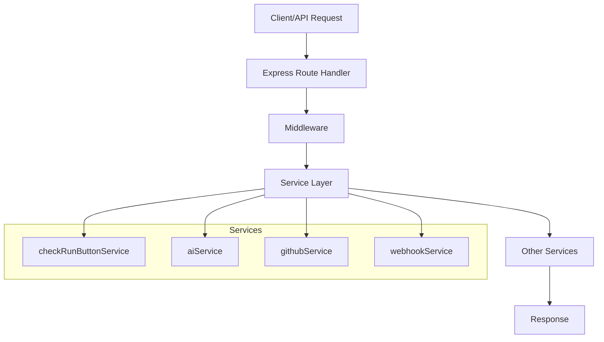

# GitHub AI Reviewer API Flow Documentation

This document provides a detailed overview of the API calling flow, payloads, and responses for the GitHub AI Reviewer project. It describes how data moves through the system, which functions interact, and what each endpoint expects and returns. A pictorial flow is included for easy understanding.

---

## API Calling Flow Overview

The project is structured as an Express.js server with multiple endpoints for interacting with GitHub PRs, AI analysis, and check run buttons. The main flow involves:

1. **Client/API Request**: External clients (GitHub, dashboard, or other tools) send HTTP requests to the server endpoints.
2. **Middleware**: Security headers and request logging are applied.
3. **Endpoint Handler**: The Express route handler processes the request, validates input, and interacts with services.
4. **Service Layer**: Service modules (e.g., `checkRunButtonService`, `aiService`, `githubService`) perform business logic, data fetching, and AI analysis.
5. **Response**: The handler sends a structured JSON response (or HTML for dashboard/fix suggestion) back to the client.

---

## Key Endpoints, Payloads, and Responses

### 1. `/webhook` (POST)
- **Purpose**: Receives GitHub webhook events.
- **Payload**: Raw GitHub webhook JSON.
- **Flow**:
  - Signature verified via `authMiddleware`.
  - Parsed and passed to `webhookService.handleWebhook(event, parsedPayload)`.
- **Response**:
  - `{ message: 'Webhook processed successfully', event, delivery }`

### 2. `/api/check-runs/active` (GET)
- **Purpose**: Lists active check runs.
- **Response**:
  - `{ success, timestamp, stats, activeCheckRuns: [ { checkRunId, owner, repo, ... } ] }`
- **Flow**:
  - Calls `checkRunButtonService.getStats()` and iterates `activeCheckRuns`.

### 3. `/api/check-runs/:checkRunId` (GET)
- **Purpose**: Gets details for a specific check run.
- **Response**:
  - `{ success, checkRunId, data: { owner, repo, pullNumber, ...findings } }`
- **Flow**:
  - Fetches from `checkRunButtonService.activeCheckRuns`.

### 4. `/api/check-runs/:checkRunId/check-merge` (POST)
- **Purpose**: Checks merge readiness for a PR.
- **Payload**: `{ checkRunId }` (in URL)
- **Flow**:
  - Gets check run data, calls `checkRunButtonService.checkMergeReadiness(owner, repo, pullNumber, analysis, checkRunData)`.
- **Response**:
  - `{ success, message, checkRunId, mergeAssessment, timestamp }`

### 5. `/api/check-runs/:checkRunId/commit-fixes` (POST)
- **Purpose**: Commits all AI-suggested fixes for a check run.
- **Payload**: `{ checkRunId }` (in URL)
- **Flow**:
  - Calls `checkRunButtonService.commitAllFixSuggestions(...)`.
- **Response**:
  - `{ success, message, checkRunId, results: { successCount, errorCount, errors, committedFixes }, timestamp }`

### 6. `/api/fix-suggestion` (POST)
- **Purpose**: Gets a fix suggestion for a specific finding.
- **Payload**:
  - `{ owner, repo, pullNumber, finding }`
- **Flow**:
  - Gets PR data via `githubService.getPullRequestData`, file content via `checkRunButtonService.getFileContent`, then calls `aiService.generateCodeFixSuggestion`.
- **Response**:
  - `{ success, fixSuggestion, timestamp }`

### 7. `/api/merge-readiness` (POST)
- **Purpose**: Assesses merge readiness for a PR.
- **Payload**:
  - `{ owner, repo, pullNumber }`
- **Flow**:
  - Gets PR data, review comments, current status, calls `aiService.assessMergeReadiness`.
- **Response**:
  - `{ success, mergeAssessment, prData, timestamp }`

### 8. `/api/commit-fix` (GET)
- **Purpose**: Serves an HTML page for a specific fix suggestion.
- **Payload**:
  - `data` query param (JSON-encoded commit data)
- **Response**:
  - HTML page with code, fix, and commit message.

---

## Function Interaction Map

- **Route Handler** → **Service Function** → **Other Service/Utility**
- Example: `/api/check-runs/:checkRunId/check-merge` → `checkRunButtonService.checkMergeReadiness` → may call `aiService` or `githubService` internally.

---

## Pictorial API Flow



---

## Example Payloads and Responses

### Fix Suggestion Request
**POST** `/api/fix-suggestion`
```json
{
  "owner": "octocat",
  "repo": "hello-world",
  "pullNumber": 42,
  "finding": {
    "file": "src/app.js",
    "line": 10,
    "issue": "Hardcoded password",
    "severity": "CRITICAL"
  }
}
```
**Response:**
```json
{
  "success": true,
  "fixSuggestion": "Replace hardcoded password with environment variable.",
  "timestamp": "2025-09-08T12:34:56.789Z"
}
```

### Merge Readiness Request
**POST** `/api/merge-readiness`
```json
{
  "owner": "octocat",
  "repo": "hello-world",
  "pullNumber": 42
}
```
**Response:**
```json
{
  "success": true,
  "mergeAssessment": {
    "ready": false,
    "issues": ["Critical security issue found"]
  },
  "prData": {
    "number": 42,
    "title": "Add login feature",
    "author": "octocat",
    "mergeable": true,
    "merge_state": "clean"
  },
  "timestamp": "2025-09-08T12:34:56.789Z"
}
```

---

## Summary Table
| Endpoint | Main Service | Input | Output |
|----------|--------------|-------|--------|
| `/webhook` | webhookService | GitHub event | Status |
| `/api/check-runs/active` | checkRunButtonService | - | Active runs |
| `/api/check-runs/:id` | checkRunButtonService | id | Run details |
| `/api/check-runs/:id/check-merge` | checkRunButtonService | id | Merge assessment |
| `/api/check-runs/:id/commit-fixes` | checkRunButtonService | id | Fix results |
| `/api/fix-suggestion` | aiService, githubService | PR/finding | Fix suggestion |
| `/api/merge-readiness` | aiService, githubService | PR | Merge assessment |
| `/api/commit-fix` | - | commit data | HTML page |

---

## Notes
- All endpoints return structured JSON except `/api/commit-fix` (HTML).
- Service functions are responsible for business logic and may call other services/utilities.
- Error handling is consistent: errors return `{ error, message }`.

---

## For More Details
See the source code in `src/index.js` and service modules in `src/services/` for implementation details.
